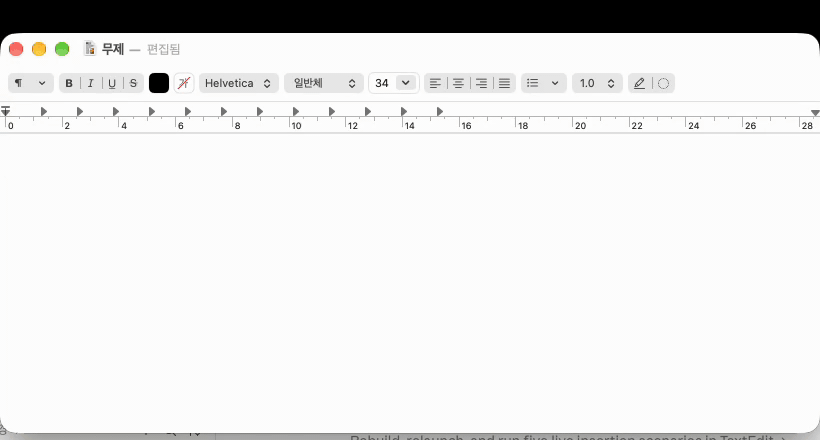
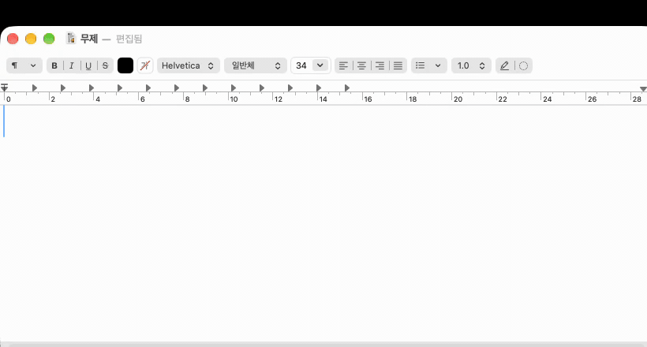

# HanMoji

한글 단어를 치면 어울리는 이모지 후보가 커서 위에 뜨고, Tab 한 번으로 그 단어를 이모지로 바꿔 주는 macOS 메뉴바 앱입니다. 슬랙, 메모, 브라우저 등 어느 앱에서든 동작합니다. 카카오톡 이모티콘 플러스의 "단어 → 이모티콘 추천"을 시스템 전체로 가져온 것이라 보면 됩니다.



- **트리거 없음**: ":"나 단축키 없이, 한글을 치는 동안 후보가 자동으로 뜹니다.
- **포커스 유지**: 후보 띠는 키보드 포커스를 가져가지 않습니다. 무시하고 계속 타이핑하면 그냥 사라집니다.
- **Enter는 건드리지 않음**: 채팅 앱에서 메시지 전송이 막히지 않도록 삽입 키는 **Tab**입니다.
- **한국어 키워드**: Unicode CLDR 한국어 주석(annotations)을 기반으로 약 1,900개 이모지에 한글 키워드가 붙어 있습니다.
- **조합 중 검색**: "기쁘"까지만 쳐도 "기쁨"을 찾고, "사랑해"처럼 조사가 붙어도 "사랑"으로 인식합니다.

## 동작 방식

### 자동 팝업 (기본)

1. 한글 두벌식 입력 소스가 켜진 상태에서 아무 앱에나 글을 칩니다.
2. 지금 치고 있는 단어가 2글자 이상이고 이모지 키워드와 정확히 또는 접두로 일치하면 캐럿 위에 후보 띠가 뜹니다.
3. 후보가 떠 있는 동안:

| 키 | 동작 |
|---|---|
| **Tab** | 강조된 후보로 단어를 교체 |
| **←  →** | 후보 이동 |
| **Esc** | 이 단어에 대해 닫기 (다음 단어부터 다시 뜸) |
| Enter | 그대로 통과 (설정에서 "Enter 키로도 삽입"을 켤 수 있음) |
| 그 외 | 그대로 통과. 계속 타이핑하면 후보가 갱신됨 |

4. 스페이스, 문장부호, Enter, 방향키, 마우스 클릭, 앱 전환이 단어의 경계입니다. 경계를 넘으면 띠가 사라집니다.

교체는 입력한 단어를 Backspace로 지운 뒤 이모지를 붙여넣는 방식입니다. 조합 중인 마지막 글자는 macOS 한글 IME의 자모 단위 삭제 규칙에 맞춰 Backspace 횟수를 계산합니다(아래 "한글 IME 백스페이스 규칙" 참고).

### 검색 패널 (보조)



⌃⌥Space(설정에서 변경 가능)를 누르면 마우스 커서 근처에 검색 패널이 뜹니다. 한글, 초성("ㄱㅃ"), 영어로 검색하고 방향키로 이동해 Enter로 삽입합니다. 검색어가 비어 있으면 최근 사용한 이모지를 보여줍니다. 접근성 권한이 없을 때는 이 패널에서 클립보드 복사만 됩니다.

### 검색 규칙

- 한글 키워드와 이름(tts), 영어 키워드와 이름을 모두 검색합니다.
- 정확 일치 > 접두 일치 > 단어 접두("웃는 얼굴"의 "얼굴") > 키워드가 검색어의 접두("사랑해" → "사랑") > 부분 일치 순으로 정렬하고, 동급이면 최근 사용 순입니다.
- 초성 검색: 낱자음은 초성으로 비교합니다. "ㄱㅃ" → 기쁨.
- 마지막 글자에 종성이 없으면 종성은 와일드카드입니다. "기쁘" → 기쁨. 조합 중인 상태에서도 후보가 유지됩니다.
- 자동 팝업은 부분 일치를 제외하고 좁게, 검색 패널은 부분 일치까지 넓게 매칭합니다.

## 요구 사항

- macOS 14 이상 (개발·검증은 macOS 27에서 했습니다)
- Xcode 15 이상 또는 Swift 5.10 이상 툴체인
- 한글 두벌식 입력 소스 (세벌식은 아직 지원하지 않습니다)

## 빌드와 실행

```bash
git clone <this repo> && cd HanMoji
make run
```

`make run`은 릴리스 빌드 → `build/HanMoji.app` 번들 생성 → 번들 안의 바이너리를 직접 실행합니다. 로그가 터미널에 찍히므로 개발 중에 편합니다. 백그라운드로 띄우려면 `make open`, 유닛 테스트는 `make test`입니다.

| 명령 | 설명 |
|---|---|
| `make build` | `swift build -c release` |
| `make bundle` | `.app` 번들 생성 + 서명 |
| `make run` | 번들 후 터미널에서 실행 (로그 표시) |
| `make open` | 번들 후 `open`으로 실행 |
| `make test` | HanMojiCore 유닛 테스트 |
| `make data` | CLDR/emoji-test 다운로드 후 `emoji.json` 재생성 |
| `make clean` | `.build`, `build` 삭제 |

디버그 로그를 보려면 `HANMOJI_DEBUG=1 build/HanMoji.app/Contents/MacOS/HanMoji`로 실행합니다. 키마다 인식된 자모, 조합 중인 단어, 후보 목록이 찍힙니다.

Xcode 프로젝트는 없습니다. Xcode에서 열려면 `Package.swift`를 열면 됩니다.

실제 타이핑을 흉내내 자동 팝업을 테스트하려면 `scripts/keypost.swift`를 쓰세요. HID 레벨로 키를 보내 이벤트 탭을 통과합니다(AppleScript의 `key code`는 대상 앱에 직접 전달돼 탭을 거치지 않습니다).

```bash
swiftc -O -o /tmp/keypost scripts/keypost.swift
# TextEdit 등에 포커스를 두고, 한글 두벌식 상태에서 "기쁨" 입력 후 Tab
/tmp/keypost r l Q m a WAIT-800 TAB
```

## 권한 설정

HanMoji는 **손쉬운 사용(접근성)** 권한 하나만 필요합니다. 키 입력 감시(CGEventTap), 캐럿 위치 조회(Accessibility API), Backspace와 ⌘V 시뮬레이션이 모두 이 권한으로 동작합니다.

1. 첫 실행 시 안내 대화상자가 뜹니다. "시스템 설정 열기"를 누르면 시스템 설정 → 개인정보 보호 및 보안 → 손쉬운 사용이 열리고 HanMoji가 목록에 추가됩니다.
2. HanMoji 스위치를 켭니다. 앱을 재시작할 필요는 없습니다. 2초 안에 감지해 메뉴바 아이콘이 바뀝니다.

메뉴바 아이콘 상태:

| 아이콘 | 의미 |
|---|---|
| 웃는 얼굴 | 정상. 자동 팝업 켬 |
| 점선 얼굴 | 자동 팝업 꺼짐 (메뉴에서 토글) |
| 경고 삼각형 | 접근성 권한 없음 |

권한이 없으면 자동 팝업은 동작하지 않고, 검색 패널에서 선택한 이모지는 클립보드에 복사만 됩니다.

### 서명과 권한 유지

접근성 권한은 앱의 코드 서명 기준으로 기억됩니다. ad-hoc 서명(`codesign -s -`)은 빌드마다 서명이 바뀌어 **재빌드할 때마다 권한을 다시 켜야** 합니다. `scripts/bundle_app.sh`는 다음 순서로 서명 identity를 고릅니다.

1. 환경변수 `CODESIGN_IDENTITY`
2. 키체인의 "HanMoji Dev" 자체 서명 인증서
3. 키체인의 Apple Development 인증서 (Xcode에 로그인돼 있으면 보통 있음)
4. ad-hoc

Apple 개발자 계정이 없다면 자체 서명 인증서를 한 번 만들어 두면 됩니다. 키체인 접근 → 메뉴 키체인 접근 → 인증서 지원 → 인증서 생성. 이름 `HanMoji Dev`, 신원 유형 "자체 서명 루트", 인증서 유형 "코드 서명"으로 만들면 스크립트가 자동으로 사용합니다.

권한이 꼬였을 때 초기화:

```bash
tccutil reset Accessibility com.hanmoji.HanMoji
```

## 설정

메뉴바 아이콘 → 설정…

- **자동 팝업**: 켬/끔, 최소 글자 수(1~3), 조사 인식, 영어 입력 중 표시(기본 꺼짐), 후보 개수(5~10)
- **키**: Enter 키로도 삽입 (기본 꺼짐)
- **삽입 방식**: 클립보드 붙여넣기(기본, 삽입 후 원래 클립보드 복원) / 유니코드 직접 입력(클립보드를 건드리지 않지만 일부 앱에서 결합 이모지가 깨질 수 있음)
- **검색 패널**: 단축키 변경, 위치(마우스 근처 / 화면 중앙)
- **제외 앱**: 메뉴바 메뉴의 "〈앱 이름〉에서 자동 팝업 끄기"로 추가. 코드 편집기나 터미널처럼 Tab이 중요한 앱에 유용합니다.

## 개인정보

- 키 입력은 "현재 치고 있는 단어" 하나만 메모리에 유지하며 단어 경계마다 버립니다. 파일에 쓰거나 네트워크로 보내지 않습니다. 네트워크 코드가 없습니다.
- 비밀번호 입력란은 macOS 보안 입력 모드가 켜져 이벤트 탭에 키가 전달되지 않습니다.
- 우리 앱 자신(설정 창, 검색 패널)으로 가는 키 입력은 추적하지 않습니다.
- 클립보드는 삽입 순간에만 잠깐 쓰고 0.3초 뒤 원래 내용으로 복원합니다. 그 사이 사용자가 다른 것을 복사했다면 덮어쓰지 않습니다. 클립보드 관리자가 이모지를 기록하지 않도록 `org.nspasteboard.TransientType` 표식을 붙입니다.

## 이모지 데이터 갱신

`Sources/HanMoji/Resources/emoji.json`은 두 소스를 합쳐 만듭니다.

- **Unicode emoji-test.txt**: 마스터 목록. 완전 규격(fully-qualified) 시퀀스, 그룹, 표시 순서, 영어 이름
- **CLDR annotations** (`annotations/ko.xml`, `annotationsDerived/ko.xml`, 영어 동일): 한국어 키워드와 이름(tts), 영어 키워드

```bash
make data                                    # 최신 CLDR release + emoji-test latest
CLDR_TAG=release-48-2 EMOJI_VERSION=17.0 make data
EMOJI_MAX_VERSION=17.0 make gen              # 다운로드 없이 재생성
```

- CLDR의 `cp` 속성에는 보통 VS16(U+FE0F)이 빠져 있어 양쪽 모두 FE0F를 제거한 문자열로 조인합니다.
- 스킨톤 변형(U+1F3FB~1F3FF)은 기본 제외합니다. `--include-skin-tones`로 포함할 수 있습니다.
- `EMOJI_MAX_VERSION`(기본 17.0)보다 새 이모지는 제외합니다. 새 버전 이모지는 CLDR 한국어 주석이 아직 없고 OS 폰트가 렌더링하지 못할 수 있습니다.
- 생성기는 `Sources/hanmoji-datagen`의 Swift CLI입니다. Python 등 외부 의존성이 없습니다.

## 프로젝트 구조

```
Package.swift                     Swift Package (Swift 5 언어 모드, macOS 14+)
Makefile                          build / bundle / run / test / data
scripts/
  fetch_data.sh                   CLDR + emoji-test 다운로드 → Data/raw/
  bundle_app.sh                   .app 번들 생성, Info.plist, 서명
Data/Info.plist.template          LSUIElement 등
Sources/
  HanMojiCore/                    순수 Foundation. 유닛 테스트 대상
    Hangul.swift                  음절 ↔ 초/중/종성, 복합 종성·모음 규칙, 쌍자음
    HangulPattern.swift           검색어 → 부분 음절 패턴, 토큰 매칭과 등급
    HangulComposer.swift          두벌식 오토마타 (조합, 도깨비불, Backspace 횟수)
    SearchEngine.swift            인메모리 인덱스, 검색/후보 정렬
    RecentStore.swift             최근 사용 (UserDefaults)
    EmojiEntry.swift              데이터 모델
  HanMoji/                        앱 (AppKit + SwiftUI)
    App/                          진입점, 메뉴바, 단축키(Carbon), 권한, 설정 저장
    Watch/                        CGEventTap, 입력 소스 감지, 단어 추적, 캐럿 위치(AX)
    Overlay/                      캐럿 위 후보 띠 (nonactivating NSPanel + SwiftUI)
    Panel/                        검색 패널 (NSTextField + SwiftUI 그리드)
    Insert/                       Backspace/⌘V 시뮬레이션, 클립보드 백업·복원, HUD
    Settings/                     설정 창 (SwiftUI), 단축키 레코더
    Resources/emoji.json          생성된 데이터 (커밋됨)
  hanmoji-datagen/                emoji.json 생성기
Tests/HanMojiCoreTests/           한글 분해, 오토마타, 패턴 매칭, 정렬, 성능
docs/                             데모 GIF
```

검색 인덱스는 앱 시작 시 한 번 만듭니다(1,914개 이모지, 약 27,000 토큰, 20ms). 검색은 디버그 빌드에서도 평균 4ms 안에 끝납니다.

## 한글 IME 백스페이스 규칙

단어를 이모지로 교체할 때 보내는 Backspace 횟수는 macOS 한글 IME의 실제 동작을 TextEdit에서 한 번씩 측정해 맞췄습니다(macOS 27). `HangulComposer.deletionKeystrokes`가 이 규칙을 구현하고 테스트가 측정값을 고정합니다.

| 상태 | Backspace 1회의 결과 |
|---|---|
| 확정된 음절 | 음절 전체 삭제 |
| 조합 중 음절의 종성 | 종성 삭제. 복합 종성(ㄺ)은 첫 자음만 남음. 쌍자음 종성(ㅆ)도 1회 |
| 조합 중 음절의 중성 | 중성 삭제. 두 키로 만든 복합 모음(ㅘ)은 첫 모음만 남음. ㅒ/ㅖ는 1회 |
| 조합 중 음절의 초성 쌍자음(ㅃ) | 홑자음(ㅂ)으로. 즉 쌍자음 초성은 2회 |
| 도깨비불로 넘어간 자음 | 이전 음절은 확정됨. "가기" → "가ㄱ" → "가" |

다른 macOS 버전이나 서드파티 입력기(구름 등)는 규칙이 다를 수 있습니다. 어긋나면 교체 결과에 글자가 남거나 한 글자가 더 지워집니다.

## 알려진 제약

- 두벌식만 지원합니다. 세벌식, 로마자 입력기에서는 자동 팝업이 뜨지 않습니다.
- Electron 앱 등 일부 앱은 캐럿 좌표를 접근성 API로 주지 않아 후보 띠가 입력창 위나 창 하단 근처로 폴백됩니다.
- Tab이 중요한 앱(코드 편집기, 터미널, 폼)에서는 후보가 떠 있을 때 Tab이 가로채집니다. 제외 앱에 추가하거나 Esc로 닫고 Tab을 누르세요.
- 조사가 붙은 단어("기쁨이었다")를 Tab으로 교체하면 단어 전체가 이모지로 바뀝니다.
- 이모지 렌더링은 OS 폰트에 따릅니다. 데이터는 Emoji 17.0까지 포함합니다.

## TODO

- ":" 트리거 모드 (Rocket 방식): 자동 팝업 대신 ":기쁨"처럼 명시적으로 부를 때만 뜨는 옵션
- 사용자 커스텀 키워드
- 이모지 외 유니코드 기호, 카오모지
- 스킨톤 선택
- 세벌식 지원
- 조사 붙은 단어 교체 시 매칭된 부분만 교체
- 로그인 시 자동 실행 (SMAppService)
- 접근성 API로 단어를 직접 선택·교체해 Backspace 의존 줄이기

## 라이선스

[MIT License](LICENSE). 이모지 데이터(`emoji.json`)는 [Unicode License](https://www.unicode.org/license.txt)를 따르는 Unicode CLDR과 emoji-test.txt에서 생성했습니다.
